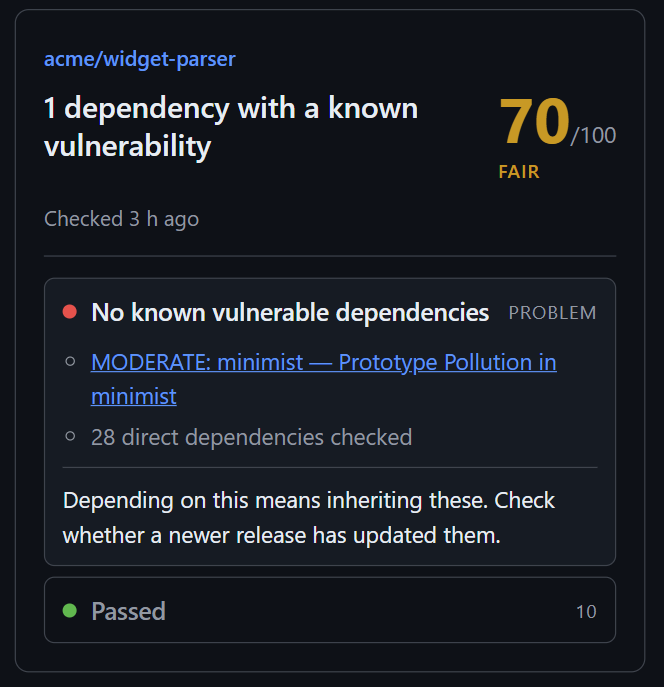
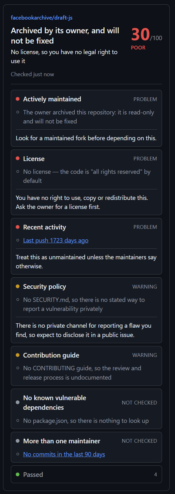
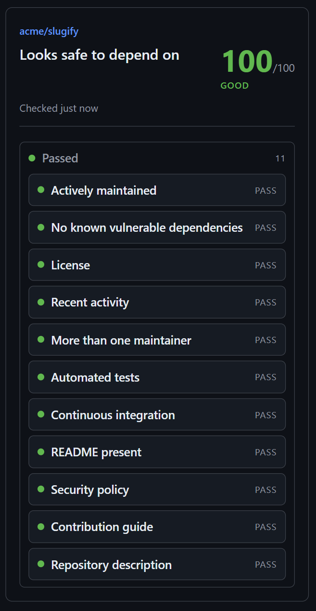

# Forkwise

[](https://github.com/Kiriesh45/Forkwise/actions/workflows/ci.yml)
[](LICENSE)

> Stars measure popularity, not health. Forkwise reads the repository you are
> looking at and tells you, in one sentence, whether you can depend on it.

A Chrome extension (Manifest V3). It opens a side panel beside github.com and
answers the question stars cannot: **should I depend on this?**

<p align="center">
  
</p>

## What it says

The panel opens with a verdict, not with a number:

> **Archived by its owner, and will not be fixed** — Poor
>
> **1 dependency with a known vulnerability** — Fair
>
> **Looks safe to depend on** — Good

The sentence is built from the findings that actually decided the outcome. The
score sits beside it as corroboration, because a number on its own only means
something to someone who has read the model behind it. Underneath is every
check, worst first, each carrying evidence you can click and verify.

<details>
<summary>Two more panels: an archived repository, and a healthy one</summary>

<p align="center">
  
  
</p>

</details>

## The problem

A repository can have four thousand stars and still be unmaintained for two
years, have a single maintainer, ship no license, and depend on packages with
published vulnerabilities. Finding that out means opening six tabs and reading
carefully.

## What it checks

| Check                                                    | What a failure means                                                         |
| -------------------------------------------------------- | ---------------------------------------------------------------------------- |
| Archived                                                 | The owner has declared the project read-only. Nothing will be fixed.         |
| Known vulnerabilities                                    | A dependency version matches a published advisory in [OSV](https://osv.dev). |
| License                                                  | No license means "all rights reserved" — legally not reusable.               |
| Recent activity                                          | Nobody has pushed in over a year.                                            |
| Maintainers                                              | One person's attention is the whole project's bus factor.                    |
| Tests, CI                                                | Nothing automatically stops a release from breaking dependents.              |
| README, security policy, contribution guide, description | Signals of how the project is run.                                           |

Weights, ceilings and the argument behind every number are in
[docs/scoring.md](docs/scoring.md).

## Four rules it follows

1. **No claim without evidence.** Every result links to the file, commit or
   advisory it came from.
2. **Guesses never fail a repository.** Test and CI detection matches naming
   conventions and can be wrong, so it warns at worst. Only facts fail.
3. **"Unknown" is an answer.** When GitHub truncates a huge file tree, or a
   library ships no lockfile, Forkwise says so and leaves the score alone
   rather than assuming the worst.
4. **It talks to the reader, not to the owner.** Advice under a finding is for
   someone deciding whether to depend on the repository. "Add a LICENSE file"
   is useless to a person who cannot commit to it.

## What it cannot do

Stated here rather than left to be discovered:

- **Vulnerability scanning needs an exact version.** Applications commit a
  lockfile; most libraries do not, and a declared range like `^18.2.0` could
  install anything below 19.0.0. Forkwise reports what it could not check
  instead of guessing.
- **npm only, and only direct dependencies.** Other ecosystems are in OSV but
  are not parsed here yet.
- **Scores are not comparable between repositories.** Checks that come back
  "unknown" leave the denominator, so two scores can be computed over
  different sets of questions.
- **The scale saturates.** Any well-run project reaches 100, so the model tells
  bad from good but not good from excellent.
- **Every threshold is a judgement call** — ninety days, three contributors,
  each ceiling. They are argued in the docs, not measured.

## Privacy

No account, no backend, no telemetry. Requests go from your browser to
`api.github.com` and `api.osv.dev`, and nowhere else. Analyses are cached
locally for a day so that browsing does not exhaust GitHub's request limit.

Full text: [docs/privacy-policy.md](docs/privacy-policy.md). What could go
wrong and what was done about it: [docs/threat-model.md](docs/threat-model.md).

## Install

Not yet in any extension store. To run it from source you need Node.js 20 or
newer:

```bash
git clone https://github.com/Kiriesh45/Forkwise.git
cd Forkwise
npm ci
npm run build
```

Then open `chrome://extensions`, turn on **Developer mode**, choose **Load
unpacked**, and select `.output/chrome-mv3`.

Open any repository on github.com and click the Forkwise icon.

### Optional: a GitHub token

Without one, GitHub allows 60 API requests an hour and a single analysis costs
up to five. A fine-grained token **with no permissions selected** raises that
to 5000. Add it under the extension's options.

Extension storage is not encrypted; the options page says so before you paste
anything.

## Development

```bash
npm run dev          # extension with hot reload
npm test             # unit tests
npm run lint         # eslint, including type-aware rules
npm run typecheck    # tsc
npm run preview      # render the panel to .output/preview.html, no browser needed
npm run play -- owner/repo   # run the analysis in the terminal, no browser
```

`npm run play` is the fastest way to work on checks: the whole analysis engine
is plain TypeScript with no browser dependencies. `npm run preview` is the
fastest way to work on the panel, and it drives the real components with the
real checks, so it cannot show you something the extension would not.

## How it is put together

- [docs/architecture.md](docs/architecture.md) — the layers and why they are
  separated
- [docs/scoring.md](docs/scoring.md) — weights, ceilings and their rationale
- [docs/decisions/](docs/decisions) — records of decisions and rejected
  alternatives
- [docs/ROADMAP.md](docs/ROADMAP.md) — what is built and what is next

## Contributing

Issues and pull requests are welcome — see [CONTRIBUTING.md](CONTRIBUTING.md).
Reports of a **wrong verdict** are especially useful: a security tool that
misjudges a repository is worse than none, and there is an issue template for
exactly that.

## License

MIT — see [LICENSE](LICENSE).
